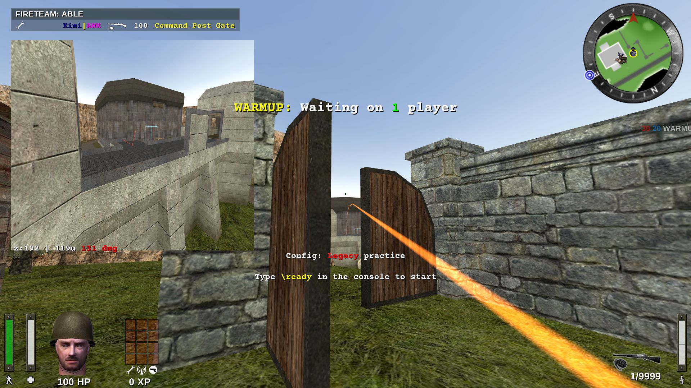
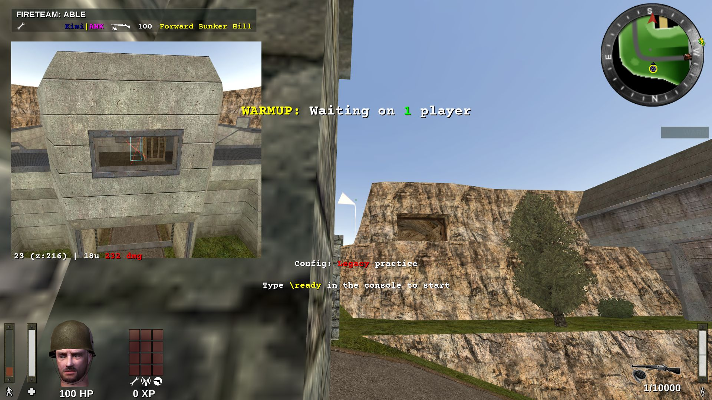
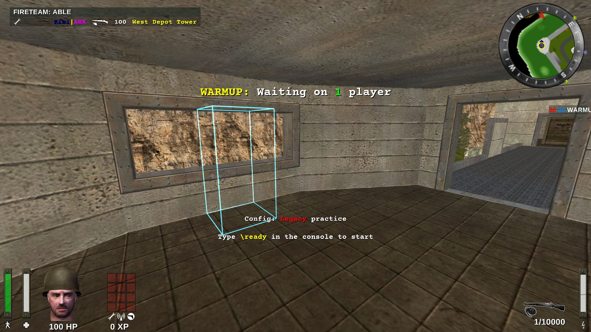

# Missile trajectory preview

Hold your Activate key and the missile camera shows you where your grenade, riflenade, panzerfaust
or mortar round would actually land — the full arc drawn in the world, every bounce, and how much
splash damage it would do to a target you can drop anywhere on the map.

It is a practice tool. It only works with cheats enabled or in a demo, so it cannot be used in a
real match.



## Installation

This is a mod, not a new game build — it runs on your normal ET:Legacy client, and you can undo it
by deleting the files again.

1. Download **`etlegacy-mod-<version>.zip`** from the
   [releases page](https://github.com/mittermichal/etlegacy/releases) (~55 MB).

   Download the whole zip, not just the `legacy_<version>.pk3` next to it. The pk3 holds only the
   client-side part of the mod; the `qagame` files in the zip are the server-side half. Because the
   preview needs cheats, you will be hosting the game yourself, so **your own `qagame` is what runs
   the shot** — and if it is left over from a different version, it may not match this build's
   client. Installing both halves from the same zip avoids the whole question.

2. Find the `legacy` folder inside your ET:Legacy user directory:

   | OS | Folder |
   | --- | --- |
   | Windows | `%userprofile%\Documents\ETLegacy\legacy\` |
   | macOS | `~/Library/Application Support/etlegacy/legacy/` |
   | Linux | `~/.etlegacy/legacy/` |

   (Upstream's [Path and File Structure](https://github.com/etlegacy/etlegacy/wiki/Path-and-File-Structure)
   page explains the full layout. If those folders do not match your install, type `/fs_homepath`
   in the console — it prints the folder the game is actually using.)

3. Extract the zip into that folder. You need two files:

   - `legacy_<version>.pk3`
   - the `qagame` for your system:

     | System | File |
     | --- | --- |
     | Windows 64-bit | `qagame_mp_x64.dll` |
     | Windows 32-bit | `qagame_mp_x86.dll` |
     | macOS | `qagame_mac` |
     | Linux 64-bit | `qagame.mp.x86_64.so` |
     | Linux 32-bit | `qagame.mp.i386.so` |
     | Linux ARM | `qagame.mp.aarch64.so` |

   The rest are the same thing for other systems, plus `tvgame` files that only matter if you run
   an ETLTV server. Deleting them is optional and saves a bit of disk space; leaving them does no
   harm.

   You are *adding* files here, not replacing any. The mod that came with the game lives in the
   install folder, and this folder normally holds only your configs, demos and screenshots. What
   you put here wins over the installed version, which is exactly what makes this work.

4. **Make sure only one `legacy_*.pk3` is left in this folder.** The one in the game's install
   folder is fine and should stay — but two of them *here* is ambiguous, and the usual symptom is
   the feature simply not appearing.

5. Start ET:Legacy.

6. **Check it loaded.** The mod version is printed in the **bottom-left corner of the main menu**,
   straight after launch — no need to join anything. It should read `v2.85.0-missile-sim2` (or
   whichever release you installed) instead of the plain `v2.85.0` of a stock install. Pressing
   `Escape` while connected to a server brings up the same menu, showing the version the server
   loaded.

   That text comes from the same pk3 as the rest of the client half, so if the version is right
   there, the preview is installed. It says nothing about the `qagame` from step 3 — that one you
   have to get right yourself.

To uninstall, delete the two files you added. The game falls back to the mod in its install
folder, exactly as before.

## Alternative: install side by side, without touching your normal setup

If you would rather not swap files in and out of the install you actually play on, give this build
its own user directory. The game takes the directory as a startup argument, so you end up with a
second shortcut that launches the same ET:Legacy against a separate set of mod files, configs and
demos. Your normal shortcut keeps working exactly as before.

`fs_homepath` **cannot be changed once the game is running** — setting it in the console does
nothing useful. It has to be a startup argument.

### 1. Create the folder and copy your settings across

Make a new folder, e.g. `ETLegacy-missile` next to your existing one, then copy over from your
current user directory (the tables in step 2 above say where that is):

| Copy | Why |
| --- | --- |
| `legacy/profiles/` | your profile: config, binds, HUD |
| `legacy/etconfig.cfg` and any `autoexec*.cfg` you use | mod settings |
| `etmain/*.pk3` | the maps you want to test on |

If you would rather not pick, copying the whole user directory works too — it is just larger,
because of demos and downloaded maps.

**Check `etmain/dlcache` for the maps you want.** Anything you downloaded from a server while
playing sits there rather than in `etmain` itself, and `/devmap` will not find it. Copy the map
pk3s you care about from `etmain/dlcache` into `etmain` — in the new directory or your usual one,
the same applies either way.

Then install the mod into the **new** folder's `legacy` directory, following steps 1 and 3 above.
Nothing in your original folder changes, so there is nothing to back up or restore.

### 2. Add the startup argument

The argument to add is:

```
+set fs_homepath "C:\Games\ETLegacy-missile"
```

with your own path, of course.

**Windows**

- Copy your ET:Legacy shortcut (so the original stays untouched), then right click the copy and
  choose `Properties` — on Windows 11, `Show more options -> Properties` first.
- In the `Target` field, append the argument at the end. If the path is already wrapped in quotes,
  the argument goes **outside** the closing quote:
  `"C:\Program Files\ETLegacy\ETL.exe" +set fs_homepath "C:\Games\ETLegacy-missile"`
- Rename the shortcut to something like `ET Legacy (missile preview)` so you can tell them apart.

**Linux**

Most desktop environments let you edit a launcher and offer a "Program arguments" field. Failing
that, copy the `.desktop` file — usually in `~/.local/share/applications` — and add the argument to
its `Exec` line:

```
Exec=/home/user/games/etlegacy/etl.x86_64 +set fs_homepath /home/user/etlegacy-missile
```

**macOS**

Use Automator to make a small launcher app:

- Open Automator, choose `Application` (or `File -> New` if no dialog appears).
- Add the `Utilities -> Run Shell Script` action.
- Enter:

  ```
  open -a "/Applications/ET Legacy/ETL.app" --args +set fs_homepath "$HOME/etlegacy-missile"
  ```

- Save it as an application and launch the game with that.

### 3. Launch and check

Start the game through the new shortcut and check the version in the bottom-left of the main menu,
as in step 6 above. To confirm the separate directory took effect, type `/fs_homepath` in the
console — it should print the new path, not your usual one.

## Turning it on

The preview needs **cheats enabled**, which normally means playing on your own machine:

```
/devmap <mapname>
```

That starts a local server with `sv_cheats 1` — you can then move around, try shots and see the
preview. It also works while **watching a demo**. On a normal server it stays off, by design.

You also need the missile camera visible on your HUD. It is on by default, and it is the same
small view that shows your grenade flying during normal play — if you can see that, you are set.

## Using it

1. Hold your **Activate** key (`F` by default — the same key you use to open doors) with a
   supported weapon equipped.
2. The predicted arc appears in the world in orange, with a four-armed marker at the predicted
   detonation point.
3. Let the key go — the last arc stays frozen on screen until you switch weapons, so you can walk
   around and look at it from another angle.

### Reading the missile camera readout



The line along the bottom of the missile camera reads:

```
177 (z:49) | 158u 92 dmg DIRECT (no LOS)
└─┬─┘ └─┬─┘   └─┬─┘ └─┬─┘  └─┬─┘   └──┬──┘
  │     │       │     │      │        └─ line of sight to the marker is blocked
  │     │       │     │      └────────── the round hits the marker box itself
  │     │       │     └───────────────── splash damage the marker would take
  │     │       └─────────────────────── distance from detonation to the marker
  │     └─────────────────────────────── height of the detonation point
  └───────────────────────────────────── distance from the detonation down to the floor
```

The `| …` half only appears once a `missiletarget` marker is placed. The ground-distance prefix
only appears when the detonation is actually off the floor.

Damage is colour-coded: **white** 0, **yellow** below 50, **orange** 50–99, **red** 100 and above.

Sometimes a small "no entry" icon appears in the corner instead of the readout. That means the
round never explodes at all — it flies out through the sky, off the edge of the map, or below the
world, and simply disappears. The preview is not failing; the real shot would do nothing either.

## Marking a target

`missiletarget` drops a player-sized box in the world, drawn as a cyan wireframe, to aim at. Shots
bounce off it the way they would off a real player, and the readout tells you how much splash
damage someone standing there would take.



Walk to the spot you want to test, open the console and type:

```
/missiletarget
```

Run it again to remove the box. That is all most people need — the rest of this section is for
setting a marker somewhere you cannot stand, or putting the same one back later.

| Command | What it does |
| --- | --- |
| `/missiletarget` | place a box where you are standing, or remove the one that is up |
| `/missiletarget <x> <y> <z>` | place a normal player box at those coordinates |
| `/missiletarget <x> <y> <z> <mins…> <maxs…>` | place a box of your own size there |

Every time you place one, the console prints the exact command that puts it back:

```
]/missiletarget
missiletarget: placed at (8486 -1383 -104), box 36x36x72 - run bare to clear
to restore it later: missiletarget 8486.450 -1383.290 -103.880 -18.000 -18.000 -24.000 18.000 18.000 48.000
```

Copy that second line somewhere. The marker is not saved — changing map or quitting the game loses
it — and pasting the printed command is the only way to get *exactly* the same box back rather than
one roughly where you were standing.

Only the plain `/missiletarget` toggles. With coordinates it always places, so you can paste a
saved marker without first checking whether one is already up.

Two things worth knowing about the box:

- **Crouching or going prone does not shrink it**, and that is correct — explosions in ET:Legacy
  always treat a player as their full standing size, whatever they are doing. Only bullets care
  about your pose.
- The damage number is **raw splash damage**. Friendly fire rules, class skills and armour are all
  applied afterwards by the server, so what a real player actually loses can be lower.

## Supported weapons

- **Rifle grenades** — K43 and Garand, in both rifle and launcher mode (the scoped versions are
  not supported)
- **Thrown** — grenade, pineapple, dynamite, landmine, satchel, smoke marker, smoke bomb
- **Panzerfaust** and **bazooka**
- **Mortar**, once it is deployed

## Known limits

- **Panzerfaust and mortar arcs have not been tested much.** Rifle grenades and thrown weapons
  have been checked shot by shot against what the server really does; those two have not.
- The preview shows your shot *as aimed right now*. Anything that changes before it lands — a
  player stepping into the path, a door opening, your own aim drifting — is not accounted for.
- Damage is only ever calculated against the marker box, never against real players.

## How accurate is it?

The preview re-runs the server's own missile physics on your machine, one step per server frame,
including bounces, sky brushes and fuse timers. On shots checked against the real thing it lands
within a hundredth of a unit of where the grenade actually went off.

That said, it is a prediction of one specific shot in a static world, so treat the number as a very
good estimate rather than a guarantee.

## For developers

The simulation lives in `CG_PredictRiflenadeTrajectory` (`src/cgame/cg_weapons.c`) and mirrors the
server's `G_RunMissile` / `G_BounceMissile` / `G_MissileImpact`. `CLAUDE.md` in the repository root
documents the gdb workflow for comparing the two against a live shot — the two-client setup, the
breakpoints worth setting, and the server behaviours that are easy to mirror wrongly. Read it
before changing the simulation: several of the bugs found so far were one-frame ordering
differences that are invisible in a side-by-side code read.
